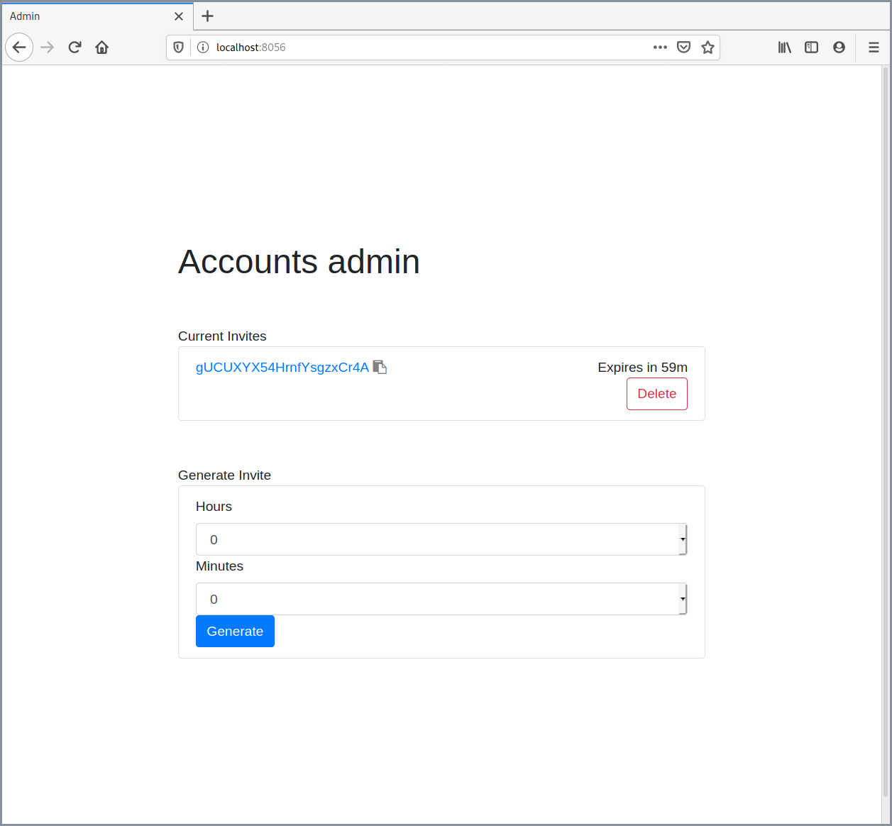
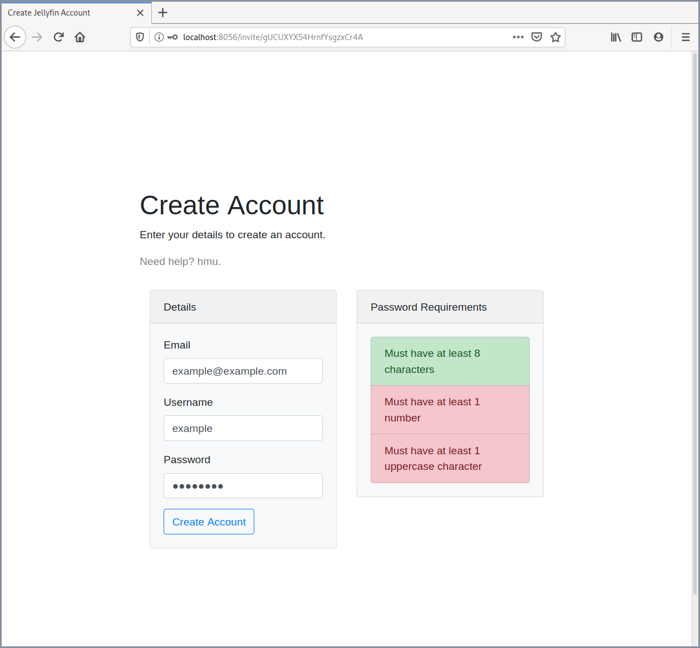

# jellyfin-accounts
***New: Now capable of sending password reset emails!***

A basic account management system for [Jellyfin](https://github.com/jellyfin/jellyfin).
* Provides a web interface for creating invite codes
* Sends out emails when a user requests a password reset
* Uses a basic python jellyfin API client for communication with the server. 
* Uses [Flask](https://github.com/pallets/flask), [HTTPAuth](https://github.com/miguelgrinberg/Flask-HTTPAuth), [itsdangerous](https://github.com/pallets/itsdangerous), and [Waitress](https://github.com/Pylons/waitress)
* Frontend uses [Bootstrap](https://getbootstrap.com), [jQuery](https://jquery.com) and [jQuery-serialize-object](https://github.com/macek/jquery-serialize-object)
* Password resets are handled using smtplib, requests, and [jinja](https://github.com/pallets/jinja)
## Screenshots
<p align="center">
    </img> </img>
</p>

## Get it
### Requirements

* This should work anywhere Python does, i've tried to not use anything OS-specific. Drop an issue if you encounter issues, of course.
```
* python >= 3.6
* flask
* flask_httpauth
* jinja2
* requests
* itsdangerous
* passlib
* secrets
* configparser
* pyOpenSSL
* waitress
* pytz
* dateutil
* watchdog
```
### Install
```
git clone https://github.com/hrfee/jellyfin-accounts.git
cd jellyfin-accounts
python3 setup.py install
```

### Usage
* Passing no arguments will run the server
```
usage: jf-accounts [-h] [-c CONFIG] [-d DATA] [--host HOST] [-p PORT] [-g]

jellyfin-accounts

optional arguments:
  -h, --help            show this help message and exit
  -c CONFIG, --config CONFIG
                        specifies path to configuration file.
  -d DATA, --data DATA  specifies directory to store data in. defaults to
                        ~/.jf-accounts.
  --host HOST           address to host web ui on.
  -p PORT, --port PORT  port to host web ui on.
  -g, --get_policy      tool to grab a JF users policy (access, perms, etc.)
                        and output as json to be used as a user template.
```
### Setup
#### Policy template
* You may want to restrict a user from accessing certain libraries (e.g 4K Movies), or display their account on the login screen by default. Jellyfin stores these settings as a user's policy.
* Make a temporary account and change its settings, then run `jf-accounts --get_policy`. Choose your user, and the policy will be stored at the location you set in `user_template`, and used for all subsequent new accounts.
#### Emails/Password Resets
* When someone initiates forget password on Jellyfin, a file named `passwordreset*.json` is created in its configuration directory. This directory is monitored and when created, the program reads the username, expiry time and PIN, puts it into a template and sends it to whatever address is specified in `emails.json`.
* **The default forget password popup references the `passwordreset*.json` file created. This is confusing for users, so a quick fix is to edit the `MessageForgotPasswordFileCreated` string in Jellyfin's language folder.**
* Currently, jellyfin-accounts supports generic SSL/TLS secured SMTP, and the [mailgun](https://mailgun.com) REST API. 
* Email html is created using [mjml](https://mjml.io), and [jinja](https://github.com/pallets/jinja) templating is used. If you wish to create your own, ensure you use the same jinja expressions (`{{ pin }}`, etc.) as used in `data/email.mjml`, and also create a plain text version for legacy email clients.

#### Configuration
* Note: Make sure to put this behind a reverse proxy with HTTPS.

On first run, the default configuration is copied to `~/.jf-accounts/config.ini`.
```
[jellyfin]
; It is reccommended to create a limited admin account for this program.
username = username
password = password
; Server will also be used in the invite form, so make sure it's publicly accessible.
server = https://jellyf.in:443
client = jf-accounts
version = 0.1
device = jf-accounts
device_id = jf-accounts-0.1

[ui]
host = 127.0.0.1
port = 8056
username = your username
password = your password
debug = false

; Displayed at the bottom of all pages except admin
contact_message = Need help? contact me.
; Displayed at top of form page.
help_message =  Enter your details to create an account.
; Displayed when an account is created.
success_message = Your account has been created. Click below to continue to Jellyfin.

[email]
; Enable to store provided email addresses, monitor jellyfin directory for pw-resets, and send pin
enabled = true
; Directory to monitor for passwordReset*.json files. Usually the jellyfin config directory
watch_directory = /path/to/jellyfin
use_24h = true
; Date format follows datetime's strftime.
date_format = %-d/%-m/%-y
; Path to custom email html. If blank, uses the internal template.
email_template =
; Path to alternate plaintext email. If blank, uses the internal template.
email_plaintext = 
; Displayed at bottom of emails
message = Need help? contact me.
; Mail methods: mailgun, smtp
method = mailgun
; Subject of emails
subject = Password Reset - Jellyfin
; Address to send from
address = jellyfin@jellyf.in
; The name of the sender
from = Jellyfin

[mailgun]

api_url = https://api.mailgun.net...
api_key = your api key

[smtp]
; Insecure SMTP hasn't been implemented, although I doubt many will need it.
ssl = true
server = smtp.jellyf.in
; Uses SMTP_SSL, so make sure the port is for this, not starttls.
port = 465
password = smtp password

[files]
; When the below paths are left blank, files are stored in ~/.jf-accounts/.

; Path to store valid invites.
invites = 
; Path to store email addresses in JSON
emails = 
; Path to the user policy template. Can be acquired with get-template.
user_template = 
```


